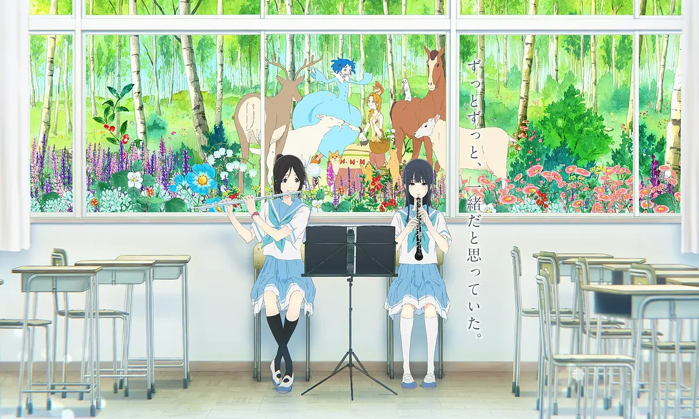

---
date:
  created: 2021-11-07
  updated: 2024-02-04
title: 利兹与青鸟：优美内敛的演出艺术
categories: 
  - 动画电影杂谈
---

# 利兹与青鸟：优美内敛的演出艺术
 —— 神啊，为什么要告诉我打开鸟笼的方法！

---
> 《莉兹与青鸟》是京都动画（京阿尼）制作的动画电影，改编自武田绫乃的小说《北宇治高中吹奏乐部，波澜起伏的第二乐章》，为《吹响吧！上低音号》系列作品，于 2018 年 4 月 21 日在日本上映。  
从剧情时间线来讲，本作是TV版《吹响吧！上低音号》的外传动画，所以人物关系是一致的，不过由于制作班底和本篇的TV版《吹响吧！上低音号》不同，且《利兹与青鸟》是一部以电影规格制作的动画，因此总体的风格并不一致。

《利兹与青鸟》给我的感受与其他大多数动画电影都不一样，它是如此细腻地描绘情绪，如同宁静的涓流；它含蓄的情感表达，几乎从不明说，但你却能感受倒人物内心那纤细复杂的情绪。这与它的镜头、声音、色彩和角色配音等构成的**演出**离不开关系。

<!-- more -->
## 专注于「小」的故事

在大部分动画电影中，故事的广度都趋于「大」，它们大多趋向于热烈的情感表达。但《利兹与青鸟》并不是一部很「大」的电影，它的规模，是一部电影所能达到的极小，它是一部专注于人物的电影，而故事几乎全部发生在一所高中。

《利兹与青鸟》用整整 90 分钟专注于描绘两个角色之间的关系。这并不是一段跌宕起伏的故事：**主人公伞木希美和铠塚霙，她们是一对处在毕业临别之际的、要好的朋友，她们对毕业的离别怀揣着各自的不安，所以尝试着去向对方表达自己 —— 这是一个关于两个互相关心的人寻求互相理解的故事**。她们必须尽快行动，而不让她们的情感纠葛影响到即将到来的 —— 双簧管与长笛在乐团公演中的合奏。这就是整部电影的冲突，听起来十分平淡无趣，实际上却有着惊人的质量。这部由山田尚子监督（导演）的作品，不仅拥有精美的画面与细腻的摄影手法，还有它细致入微的角色动画。

动画电影偏向于夸张的情感表达是有很多原因的，很少有人尝试这种独立电影式的情节，大多数的动画制作并不能撑起这样的题材。**动画角色的设计初衷便是放大他们所表现的情感，而不是用肢体和神情的细枝末节，去表现一个艺术片中小角色的所思所想**。而《利兹与青鸟》做到了，在任意时刻，你都能感受到她们的内心活动，还有对正在发生的事情的反应。电影中很多重要的转折点都在无言的一瞬发生，我们也能看到她们得到新的见解，找到问题的解决方法，抑或是感受到情感上的重担。作为动画角色，她们的演出效果真实得惊人。

## 童话故事的「隐喻」

在这样一部情节平缓的作品中，为了能让全片都保持趣味性，制作组运用了另一个拍摄技巧，给全片带来视觉上丰富的体验，也依然保留了人物关系的核心。希美和霙要参加的二重奏是一部协奏曲的一部分，协奏曲叫做《利兹与青鸟》，是基于同名童话创作的曲子，恰好，希美与霙各自都能在童话故事中找到自己的投影。影片将童话中的场景与故事场景交织在一起，童话部分运用艳丽的水彩式动画来表现，与故事场景的精细线条相比，它有着一种别样的美。**童话部分并不只是为影片添加美术多样性，它通过对同一种情感更加简单与直接的表达方式，与霙和希美现实世界中的关系形成对比，帮助我们更好地理解故事的主题，也让那些微小的细节更难被曲解**，例如她们的表情和肢体语言。

## 镜头的「情绪」

本作的镜头调度也同样出彩，山田尚子监督为了强化镜头的情感表达，将用于情感表达的镜头和用于推进故事的镜头作出了区分，不难发现，但凡是与情感表达有关的镜头大多都选用了小景别，并通过模拟手持的镜头摇晃、浅景深下焦点变化所带来虚实变化。

事实上在情感表达的镜头中也同样存在着区分，大多数一般的情感表达镜头会避开人物的脸部，而类似腿、头发和裙子都是山田所喜爱的拍摄对象（山田：腿也是心灵的窗户），例如影片进入学校的部分，霙跟随着希美的镜头，就大多拍摄二人的腿部或者仅仅展示二人的侧颜；而少数的重要的情感表达，则会对准人物面部的部位，例如霙在发现自己作为青鸟的角色时眼部的特写镜头。

!!! quote
    “高桥：外表能吸引孩子，但内在是更加成人的。在《玉子爱情故事》中有很多迷人的腿部画面；在这些场景中，角色的状态只需一个腿部镜头就能显示出来。我从来没有那样做过，请教教我们这个技巧。  
    山田：“眼睛可能是心灵的窗户”，但我认为我们的腿也是这样。通常，我们把腿藏在桌子下面，否则它们会暴露我们的真实情感。”

用于推进故事的镜头则以大景别为主，展现出人物的全貌，并且特别喜欢将人物压在建筑之前从而营造出扁平的构图，例如霙与老师在办公室中谈话时，山田就选择了正面且平视的机位。

而相比于仅仅作出区别创造出不同，山田将这两种不同的镜头作出了融合，而且并非是简单的将几个类型的镜头融合，而是将镜头、画面以及气氛等一系列的元素相融合。影片中有一段两人的远距离打招呼的互动，这段互动中并没有人物的声音，只有音乐和些许的音响，长笛的反光将她们两人联结在一起。如果将这个场景单独拎出来给某人看，他们可能不仅可以推断出希美和霙的关系，还可以推断出她们的性格和习惯。
!!! example
    [利兹与青鸟 长笛反光片段](https://www.bilibili.com/video/BV1vg4y1U7Sc/)

## 与场景「融合」的配乐

「利兹与青鸟 第三乐章『爱的决断』」是剧情高潮部分，希美与霙所演奏的曲子。在影片中，她们演奏的版本是特别制作的，我们在那包含感情的完美的双簧管演奏声和「泣不成声」的长笛声中，与人物内心共鸣，这里不需要台词，音乐就是她们的心声。

在影片中还经常使用音响音乐化的技巧，我们常常能听到丰富场景声音，如脚步声、化学实验室中玻璃碰撞声和衣服摩擦声等，随着乐器的不断加入，渐渐地融合在一起。有源音乐和无源音乐的悄然融合变换，给观众带来无比沉浸的体验。

!!! tip
    音响音乐化：音响被音乐化和艺术化，而被艺术化的音响则完全可能按照音乐的形式组织起来，使其体现出音乐的效果和感受。  
    有源音乐：是指影片的时空中实际发生的音乐，而「无源音乐」是为了烘托情绪等美学效果所加入的音乐。

## 诗歌般的电影

《利兹与青鸟》开头以二者进入学校开始，结尾以二者离开学校收束。山田尚子以细腻的影像风格，展现了人物无比纯粹的感情，为我们带来了一部如诗歌般的电影。

## 参考致谢

- [山田尚子：用心创造影像（上集）](https://www.bilibili.com/read/cv4427163/)
- [山田尚子：用心创造影像（下集）](https://www.bilibili.com/read/cv4557081/)
- [「利兹与青鸟」幕后花絮Vol. 7 监督×原作者特别谈话活动篇](https://www.bilibili.com/video/BV1s4411r7uU/)  
- [《利兹与青鸟》作品回顾 Interview 1 作画篇](https://www.bilibili.com/read/cv16615751/)  
- [「拉片」《利兹与青鸟》融合与隐藏的影像](https://www.bilibili.com/video/BV1Py4y147Jo/)
- [【音效赏析】利兹与青鸟#1 有源无源音乐变化的魔法](https://www.bilibili.com/video/BV1rB4y1b73c/) 
- [【音效赏析】利兹与青鸟#2 从校门到教室——音效的千层变化](https://www.bilibili.com/video/BV12G4y1679c/)

> 原文地址：<https://purplemoon0.github.io/PM_WIKI/>  
> 本篇文章受 [CC BY-NC-SA 4.0](https://creativecommons.org/licenses/by/4.0/deed.zh) 协议保护，转载请注明出处。